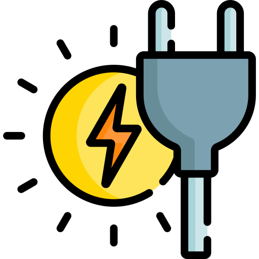

<p align="center">
  
</p>

# Carbon-Aware EV Charging

[](https://github.com/hacs/integration)
[](https://www.gnu.org/licenses/gpl-3.0)
[](https://www.home-assistant.io/)

Automatically charge your EV when the electrical grid is cleanest. This Home Assistant integration monitors real-time CO₂ intensity, computes a rolling statistical signal, and controls your charger — no YAML automation required.

---

## How It Works

Most carbon-aware charging tools use static thresholds (e.g., "charge when CO₂ < 200 g/kWh"). This integration uses a **Z-score** — a measure of how *unusual* the current CO₂ level is relative to the past 7 days:

```
Z-score = (current CO₂ − 7-day mean) / 7-day standard deviation
```

A **negative Z-score** means the grid is cleaner than usual. A **positive Z-score** means dirtier than usual. This approach adapts automatically to your local grid's baseline — it works equally well in a region averaging 50 g/kWh or 500 g/kWh.

The charger turns on when:
- The Z-score is below your chosen sensitivity threshold, **and**
- Fossil fuel generation is below 75% (a hard safety floor)

If carbon data is unavailable or the grid is consistently dirty, built-in **fallback windows** ensure your car is still charged.

---

## Features

- **Fully UI-configured** — no YAML editing needed after installation
- **Statistical carbon signal** — Z-score adapts to your grid's typical range
- **Three sensitivity modes** — from aggressive carbon avoidance to charging most of the time
- **Configurable fallback windows** — guaranteed charging windows (overnight and midday by default) on dirty-grid days, each independently adjustable and enable/disable-able
- **Roadtrip prep charging** — calendar-driven: parses events with a configurable prefix to activate full-speed charging ahead of a trip, with optional SoC targeting and charge limit control
- **Departure-day prep charging** — weekly schedule so your car is always ready on commute days
- **Hysteresis** — prevents rapid on/off switching when hovering near the threshold
- **Dwell and cooldown** — minimum 15-minute on-time and 10-minute off-time to protect the charger
- **Dry-run mode** — log decisions without touching the charger, for safe testing
- **Optional LED indicator** — RGB light shows charging state at a glance
- **Optional push notifications** — get notified when charging starts or stops
- **Persisted history** — rolling statistics survive Home Assistant restarts

---

## Prerequisites

Before installing, you need:

1. **A CO₂ intensity sensor** — the [Electricity Maps](https://www.home-assistant.io/integrations/electricity_maps/) integration provides both a CO₂ intensity sensor and a fossil fuel percentage sensor out of the box. Any sensor exposing a numeric CO₂ value (g/kWh) and a fossil fuel percentage will work.

2. **A controllable charger switch** — your charger must be exposed as a `switch` entity in Home Assistant. This integration has been tested with **Emporia** chargers. Other chargers should work as long as they present a switch entity and expose an attribute indicating whether a car is plugged in.

3. **Home Assistant 2024.1 or later**

---

## Installation

### Via HACS (Recommended)

1. Open HACS in your Home Assistant sidebar.
2. Click the three-dot menu (⋮) in the top right and choose **Custom repositories**.
3. Enter the repository URL:
   ```
   https://github.com/andrewreaganm/carbon-aware-ev-charging
   ```
   Set the category to **Integration**, then click **Add**.
4. Search for **Carbon-Aware EV Charging** in HACS and click **Download**.
5. Restart Home Assistant.

### Manual Installation

1. Download or clone this repository.
2. Copy the `custom_components/carbon_aware_ev_charging` folder into your Home Assistant `config/custom_components/` directory.
3. Restart Home Assistant.

---

## Configuration

After installation, go to **Settings → Devices & Services → Add Integration** and search for **Carbon-Aware EV Charging**. The setup wizard walks you through three steps.

### Step 1 — Sensors & Charger

| Field | Description |
|---|---|
| **CO₂ Intensity Sensor** | Entity providing real-time CO₂ intensity in g/kWh (e.g., `sensor.my_region_co2_intensity` from Electricity Maps) |
| **Fossil Fuel % Sensor** | Entity providing the current fossil fuel generation percentage (e.g., `sensor.my_region_grid_fossil_fuel_percentage`) |
| **Charger Switch** | The `switch` entity that controls your EV charger |
| **Connection Attribute** | The charger switch attribute used to detect if a car is plugged in (default: `icon_name`) |
| **Not-Connected Value** | The attribute value when no car is connected (default: `CarNotConnected`) |
| **Charger Power Sensor** *(optional)* | Sensor reporting current charge power in watts; used to populate the charge rate entity |

> **Emporia users:** The connection attribute `icon_name` with value `CarNotConnected` are the correct defaults for Emporia chargers. No changes needed.

These values are fixed after initial setup. To change them, remove the integration and re-add it.

### Step 2 — LED Indicator *(optional)*

If you have an RGB light (e.g., a smart bulb or LED strip in the garage), you can configure it here for visual status feedback.

| Field | Description |
|---|---|
| **RGB Indicator Light** | A `light` entity supporting HS colour |
| **LED Effect Selector** | A `select` entity for choosing the light's animation effect |

See [LED Indicator](#led-indicator) for colour meanings. Leave both fields blank to skip LED feedback entirely.

### Step 3 — Preferences

All preferences can be changed later via **Settings → Devices & Services → Carbon-Aware EV Charging → Configure**, without re-running the full wizard. They are also exposed as entities you can control from a dashboard.

| Field | Description | Default |
|---|---|---|
| **Carbon Sensitivity** | How strictly to follow carbon signals (`Lenient`, `Moderate`, `Strict`) | `Moderate` |
| **Departure Hour** | Hour of day (0–23) to end departure-prep charging (prep starts 3 hours before) | `5` |
| **Departure Days** | Days of the week to activate departure prep | Mon–Fri |
| **Fallback Window 1** | Overnight charging window start/end hours | `22:00–06:00` (enabled) |
| **Fallback Window 2** | Midday charging window start/end hours | `11:00–15:00` (enabled) |
| **Dry Run** | Log decisions only; do not control the charger | Off |
| **Notification Service** *(optional)* | HA notify service (e.g., `notify.mobile_app_my_phone`) | — |
| **Roadtrip Calendar(s)** *(optional)* | Calendar entities to scan for trip prep events | — |
| **Roadtrip Event Prefix** *(optional)* | Prefix identifying roadtrip events (e.g., `EV`) | — |
| **Default Roadtrip Lead Time** | Hours of prep charging before a trip (when not specified in the event) | `3` |
| **SoC Sensor** *(optional)* | Sensor reporting the car's current state of charge (%) | — |
| **Charge Limit Entity** *(optional)* | `number` or `select` entity to set the charge limit for roadtrip prep | — |

---

## Carbon Sensitivity Modes

| Mode | Z-score Threshold | Approximate Charge Frequency |
|---|---|---|
| **Lenient** | < 0.92 σ | ~82% of hours — skips only the dirtiest peaks |
| **Moderate** | < 0.47 σ | ~68% of hours — avoids above-average carbon periods |
| **Strict** | < −0.18 σ | ~43% of hours — only charges during genuinely clean windows |

All modes also enforce a **75% fossil fuel hard floor** — if more than three-quarters of grid generation is from fossil fuels, the carbon gate will not open regardless of the Z-score.

When the charger is already on, **0.4 σ of hysteresis** is added to the threshold before the charger will be turned off. This prevents rapid cycling when the signal is hovering near the boundary.

**Which mode should I use?**
- Start with **Moderate**. If your car is frequently not charged enough, switch to **Lenient**.
- Use **Strict** if you have generous charging time available and want maximum carbon reduction.

---

## Charging Decision Logic

Every 5 minutes (and immediately on relevant state changes) the integration evaluates the following priority chain. The first matching condition wins.

| Priority | Condition | Status | Charger |
|---|---|---|---|
| 1 | Charge mode set to `force_off` | Forced Off | Off |
| 2 | Charge mode set to `force_on` | Override | On |
| 3 | Carbon gate open (Z-score below threshold, fossil < 75%) | Low Carbon | On |
| 4 | Roadtrip prep window active (and SoC target not yet met) | Roadtrip Prep | On |
| 5 | Departure prep window active | Departure Prep | On |
| 6 | Carbon data unavailable and inside a fallback window | Fallback | On |
| 7 | Carbon data stale (> 60 min, 3 consecutive polls) | Data Stale | Off |
| 8 | Carbon data unavailable | Waiting for Data | Off |
| 9 | Fossil fuel % ≥ 75% | Fossil High | Off |
| 10 | Z-score above threshold | Grid Dirty | Off |

If the car is not connected, the charger is always off regardless of the above — but the integration continues to evaluate and display what it *would* do if the car were connected.

### Fallback Windows

Fallback windows only activate when carbon data is unavailable. They do not override a good or bad grid signal during normal operation.

Default windows (both configurable and independently toggleable):
- **Overnight:** 22:00–06:00
- **Midday:** 11:00–15:00

### Departure Prep

A 3-hour window before the configured departure hour activates on each selected day. For example, with a departure hour of `5`, prep charging runs from 02:00–05:00 on the selected days.

Departure prep is lower priority than the carbon gate — if the grid is clean, the charger runs under the Low Carbon status instead.

---

## Roadtrip Prep

If you configure a calendar and event prefix, the integration scans your calendar every 5 minutes for upcoming events. Any event whose title contains `[PREFIX ...]` triggers prep charging ahead of the trip.

### Event title format

```
[PREFIX optional_soc% optional_leadh]
```

Examples:
- `Road trip [EV 90% 4h]` — charge to 90% SoC, start prep 4 hours before departure
- `Drive to airport [EV 80%]` — charge to 80%, use the default lead time
- `Long drive [EV 6h]` — no SoC target, start prep 6 hours before
- `Day trip [EV]` — no SoC target, use the default lead time

If a SoC sensor is configured and the event specifies a SoC target, prep charging stops automatically once the target is reached.

If a charge limit entity is configured, the limit is set to the event's SoC target when prep charging begins.

---

## Entities Created

The integration creates a single device with the following entities:

### Sensors

| Entity suffix | Description |
|---|---|
| `co2_z_score` | Current Z-score (σ). Negative = cleaner than usual. Attributes: `mean_7d`, `stdev_7d`, `mean_30d`, `stdev_30d`, `co2` |
| `ev_charging_status` | Current charging decision status (see priority table above). Attributes: `status_reason`, `predicted_state`, `should_charge`, `z_score`, `fossil_pct` |
| `ev_charge_rate_kw` | Current charge power in kW *(only created if a power sensor is configured)* |
| `ev_charge_current` | Current charge current in amps (read from the charger switch's `charging_rate` attribute) |
| `ev_roadtrip_event` | Timestamp of the next roadtrip prep start time when a prep window is active; unavailable otherwise. Attributes: `summary`, `soc_target`, `lead_hours`, `event_start` |

### Binary Sensors

| Entity suffix | Description |
|---|---|
| `ev_low_carbon_now` | `On` when the carbon gate is open (Z-score below threshold and fossil % below 75%), regardless of car connection |
| `ev_connected` | `On` when a car is plugged in |

### Select Entities

| Entity suffix | Options | Description |
|---|---|---|
| `ev_charge_mode` | `auto` / `force_on` / `force_off` | Override the charging decision |
| `ev_carbon_mode` | `Lenient` / `Moderate` / `Strict` | Carbon sensitivity level |

### Number Entities

| Entity suffix | Range | Description |
|---|---|---|
| `ev_departure_hour` | 0–23 | Hour at which departure-prep charging ends |
| `fallback_window_1_start` | 0–23 | Fallback window 1 start hour |
| `fallback_window_1_end` | 0–23 | Fallback window 1 end hour |
| `fallback_window_2_start` | 0–23 | Fallback window 2 start hour |
| `fallback_window_2_end` | 0–23 | Fallback window 2 end hour |

### Switch Entities

| Entity suffix | Description |
|---|---|
| `fallback_window_1_enabled` | Enable/disable fallback window 1 |
| `fallback_window_2_enabled` | Enable/disable fallback window 2 |
| `dry_run` | Enable/disable dry-run mode |

---

## LED Indicator

If configured, the RGB light reflects the current grid state (what would happen if the car were connected):

| State | Colour | Effect (car connected) | Effect (car disconnected) |
|---|---|---|---|
| Low Carbon | Green | Rising | Slow Blink |
| Override | Amber | Rising | Slow Blink |
| Roadtrip Prep | Cyan | Rising | Slow Blink |
| Fallback / Departure Prep | Red | Rising | Slow Blink |
| Paused | Red | Slow Blink | Slow Blink |

The LED is only updated when its state actually changes, to avoid unnecessary service calls.

---

## Dry-Run Mode

Enable the **EV Dry Run** switch (or toggle it in integration options) to have the integration evaluate all logic and log its decisions without actually switching the charger, updating the LED, or sending notifications. Check the Home Assistant logs (filter by `carbon_aware_ev_charging`) to see the decision on each cycle. This is useful for validating configuration before going live.

---

## Example Dashboard

A ready-made dashboard is included in [`ev_dashboard.yaml`](ev_dashboard.yaml). It provides status glances, Z-score and CO₂ gauges, 48-hour history graphs, an optional Plotly charge-window overlay, and 30-day trend cards.

**To install:** Go to **Settings → Dashboards → Add Dashboard**, choose "From YAML", and paste the contents of the file. Replace the three placeholder entity IDs (`YOUR_CO2_SENSOR`, `YOUR_FOSSIL_SENSOR`, `YOUR_CHARGER_SWITCH`) with your own entities.

<details>
<summary>Dashboard YAML</summary>

```yaml
# EV Charging Dashboard — Carbon-Aware EV Charging Integration
# ─────────────────────────────────────────────────────────────────────────────
# BEFORE USING: Replace the three placeholder entity IDs below with your own.
#   1. YOUR_CO2_SENSOR        → your CO₂ intensity sensor
#   2. YOUR_FOSSIL_SENSOR     → your fossil fuel % sensor
#   3. YOUR_CHARGER_SWITCH    → your charger switch entity
#
# To install: Settings → Dashboards → Add Dashboard → choose "From YAML",
# then paste this file's contents.
# ─────────────────────────────────────────────────────────────────────────────

title: EV Charging
views:
  - title: Overview
    path: ev
    icon: mdi:ev-station
    cards:

      # ── Current Status ────────────────────────────────────────────────────
      - type: glance
        title: Current Status
        show_state: true
        entities:
          - entity: select.ev_charge_mode
            name: Mode
          - entity: binary_sensor.ev_connected
            name: Car
          - entity: YOUR_CHARGER_SWITCH   # ← replace with your charger switch
            name: Charger
          - entity: binary_sensor.ev_low_carbon_now
            name: Carbon OK
            icon: mdi:leaf

      # ── Charging Session ─────────────────────────────────────────────────
      - type: glance
        title: Charging Session
        show_state: true
        entities:
          # Remove ev_charge_rate_kw if you did not configure a power sensor.
          - entity: sensor.ev_charge_rate_kw
            name: Charge Rate
            icon: mdi:lightning-bolt
          - entity: sensor.ev_charge_current
            name: Amps
            icon: mdi:current-ac

      # ── Carbon Signal Gauges ─────────────────────────────────────────────
      - type: vertical-stack
        cards:
          - type: gauge
            title: CO2 Z-Score
            entity: sensor.co2_z_score
            min: -3
            max: 3
            needle: true
            severity:
              green: -3     # cleaner than Strict threshold (-0.18σ)
              yellow: -0.18 # Strict–Moderate band
              red: 0.92     # above Lenient threshold

          - type: gauge
            title: CO2 Intensity
            entity: YOUR_CO2_SENSOR   # ← replace with your CO₂ sensor
            unit: gCO₂/kWh
            min: 0
            max: 600
            needle: true
            severity:
              green: 0
              yellow: 250
              red: 400

          - type: gauge
            title: Fossil Fuel %
            entity: YOUR_FOSSIL_SENSOR   # ← replace with your fossil % sensor
            unit: "%"
            min: 0
            max: 100
            needle: true
            severity:
              green: 0
              yellow: 50
              red: 75

      # ── CO2 Intensity History ────────────────────────────────────────────
      - type: history-graph
        title: CO2 Intensity (48h)
        hours_to_show: 48
        entities:
          - entity: YOUR_CO2_SENSOR   # ← replace with your CO₂ sensor
            name: CO2 Intensity

      # ── Z-Score History ──────────────────────────────────────────────────
      - type: history-graph
        title: CO2 Z-Score (48h)
        hours_to_show: 48
        entities:
          - entity: sensor.co2_z_score
            name: Z-Score

      # ── Charge Window History (optional — requires custom:plotly-graph) ──
      # Install plotly-graph from HACS Frontend to use this card.
      # Green fill = carbon gate open, blue = Z-score, orange = charger on/off.
      - type: custom:plotly-graph
        title: Charge Windows (48h)
        hours_to_show: 48
        refresh_interval: 300
        entities:
          - entity: binary_sensor.ev_low_carbon_now
            name: Carbon OK
            yaxis: y2
            fill: tozeroy
            fillcolor: "rgba(0,200,80,0.15)"
            line:
              color: "rgba(0,200,80,0.4)"
              width: 1
          - entity: sensor.co2_z_score
            name: Z-Score
            yaxis: y
            line:
              color: "rgba(60,120,220,0.9)"
              width: 2
          - entity: YOUR_CHARGER_SWITCH   # ← replace with your charger switch
            name: Charger
            yaxis: y2
            line:
              color: "rgba(255,160,0,0.85)"
              width: 2
        layout:
          yaxis:
            range: [-3, 3]
            title: Z-Score (σ)
          yaxis2:
            range: [0, 1.5]
            overlaying: y
            side: right
            showgrid: false
            showticklabels: false
          shapes:
            - type: line
              x0: 0
              x1: 1
              xref: paper
              y0: -0.18
              y1: -0.18
              line:
                color: "rgba(50,200,80,0.6)"
                width: 1
                dash: dot
            - type: line
              x0: 0
              x1: 1
              xref: paper
              y0: 0.47
              y1: 0.47
              line:
                color: "rgba(255,160,0,0.6)"
                width: 1
                dash: dot
            - type: line
              x0: 0
              x1: 1
              xref: paper
              y0: 0.92
              y1: 0.92
              line:
                color: "rgba(220,60,60,0.6)"
                width: 1
                dash: dot

      # ── 30-Day CO2 Trend ─────────────────────────────────────────────────
      - type: statistics-graph
        title: CO2 Intensity – 30 Day Trend
        days_to_show: 30
        period: day
        stat_types:
          - mean
          - min
          - max
        entities:
          - entity: YOUR_CO2_SENSOR   # ← replace with your CO₂ sensor
            name: CO2 Intensity

      # ── 30-Day Z-Score Trend ─────────────────────────────────────────────
      - type: statistics-graph
        title: CO2 Z-Score – 30 Day Trend
        days_to_show: 30
        period: day
        stat_types:
          - mean
          - min
          - max
        entities:
          - entity: sensor.co2_z_score
            name: Z-Score

      # ── Controls ─────────────────────────────────────────────────────────
      - type: entities
        title: Controls
        entities:
          - entity: select.ev_charge_mode
            name: Charge Mode
          - entity: select.ev_carbon_mode
            name: Carbon Sensitivity
          - entity: number.ev_departure_hour
            name: Departure Prep Hour
          - entity: switch.fallback_window_1_enabled
            name: Overnight Fallback
          - entity: switch.fallback_window_2_enabled
            name: Midday Fallback
          - entity: switch.dry_run
            name: Dry Run
```

</details>

---

## Statistics Warmup

The Z-score requires approximately **7 days of CO₂ data** before it becomes fully meaningful. During this warmup period:

- The Z-score is computed as soon as 2 readings exist in the rolling window, but with very few data points the mean and standard deviation are not yet representative.
- When all readings are identical (stdev = 0), the Z-score is reported as `0.0` (exactly at the mean).
- The carbon gate defaults to `False` while the Z-score is unavailable, so charging falls back to the scheduled windows.
- On first install the integration automatically backfills up to 30 days of CO₂ history from the Home Assistant Recorder.
- Rolling history is persisted through restarts, so the integration does not re-warm from scratch after a reboot.

---

## Troubleshooting

**The charger isn't turning on even on clean-grid days.**
- Check that `ev_connected` is `on`. If not, verify the **Connection Attribute** and **Not-Connected Value** settings match your charger's actual attributes (check Developer Tools → States).
- Confirm `ev_low_carbon_now` is `on`. If not, check the Z-score value and your chosen sensitivity mode.
- Make sure the `ev_charge_mode` select is set to `auto`.

**The Z-score shows as unavailable.**
- The integration needs at least 2 readings to compute a Z-score. After a fresh install, wait a few minutes for the first backfill to complete.
- Check the HA logs (filter by `carbon_aware_ev_charging`) for warmup messages.

**I want to charge right now regardless of carbon.**
- Set the `ev_charge_mode` entity to `force_on`.

**A HA Repair issue appeared about a sensor being unavailable.**
- The CO₂ or fossil fuel sensor has been returning no data for more than 30 minutes. Check the Electricity Maps integration or whichever integration provides your carbon data. The repair issue clears automatically once the sensor recovers.

**The fossil fuel sensor is from a different source / has different units.**
- Any HA sensor that exposes a 0–100 numeric percentage will work. Select it in Step 1 of the configuration.

---

## Contributing

Bug reports and pull requests are welcome at [github.com/andrewreaganm/carbon-aware-ev-charging](https://github.com/andrewreaganm/carbon-aware-ev-charging).

If you have tested this integration with a charger other than Emporia and it works, please open an issue to let us know so we can update the compatibility list.

---

## License

This project is licensed under the [GNU General Public License v3.0](https://www.gnu.org/licenses/gpl-3.0.html).

## Attribution

Logo provided by flaticon.com
